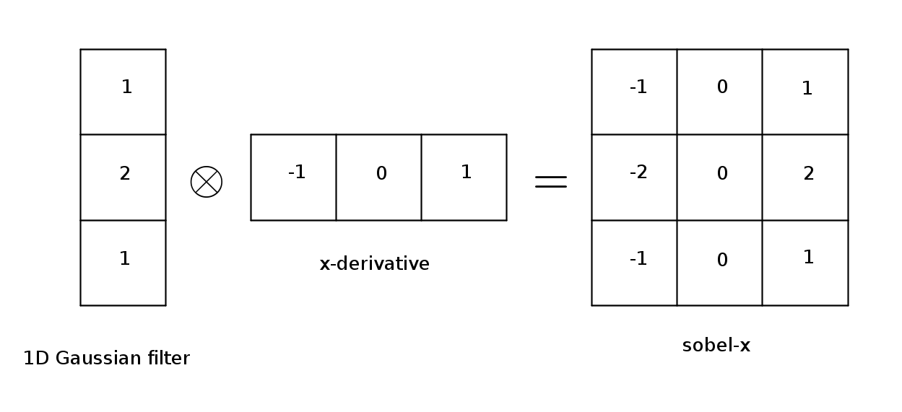
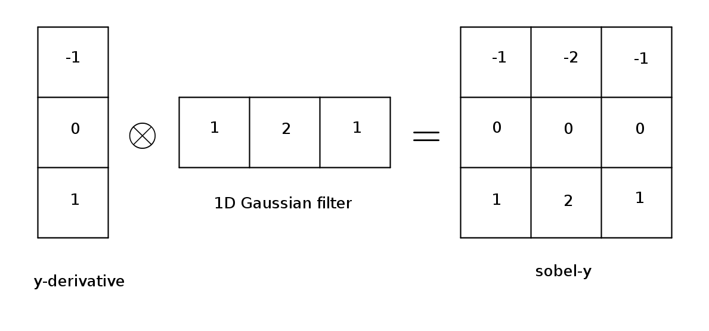
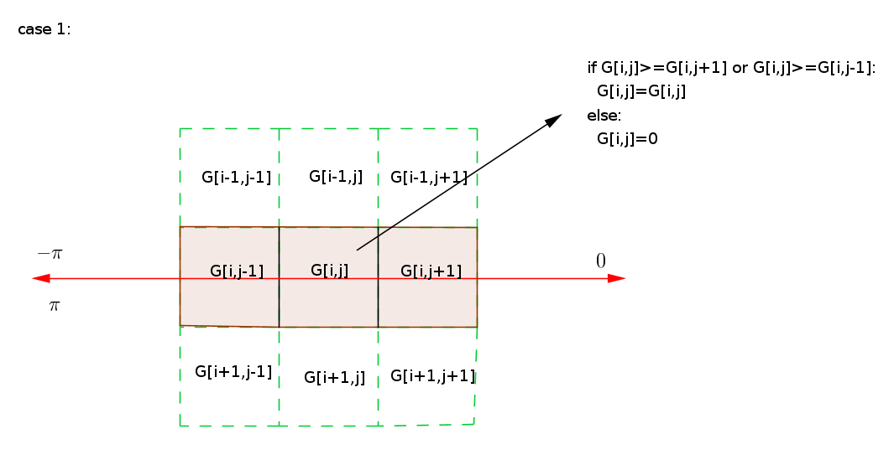
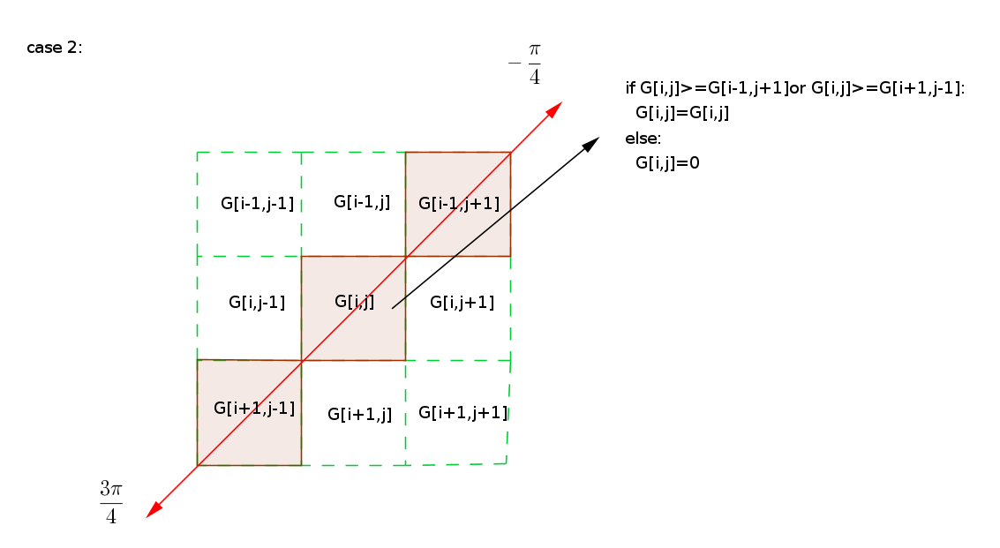
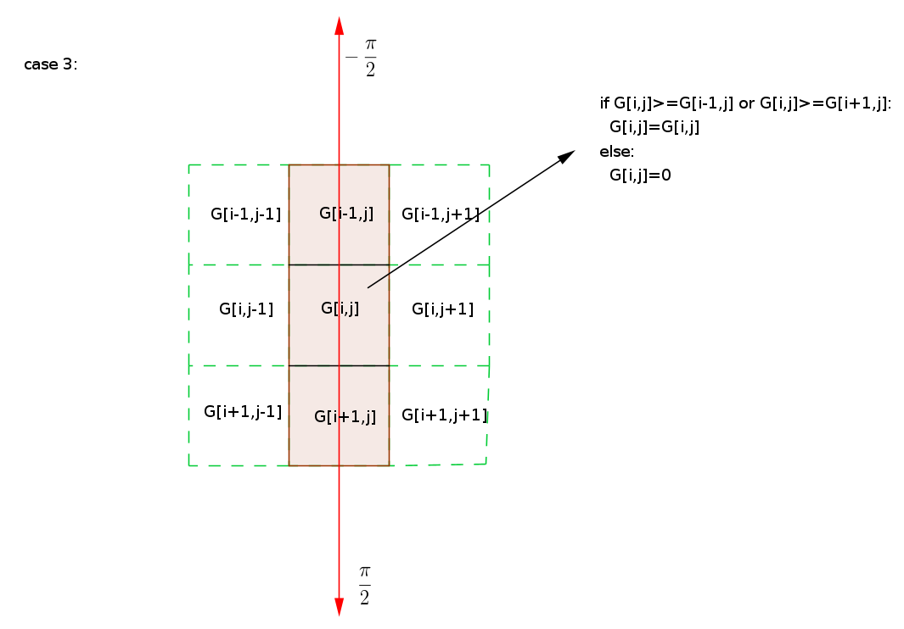
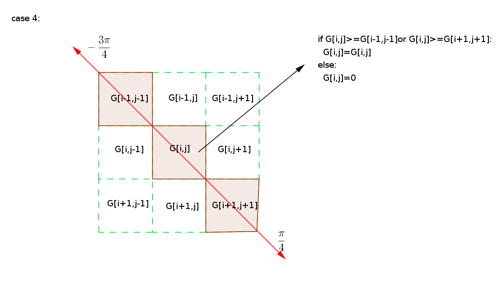
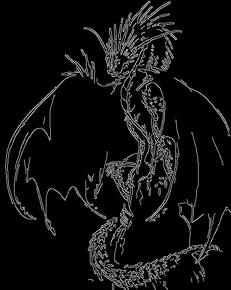

# Sobel vs. Canny Edge Detection Techniques: Step by Step Implementation

In the previous post [Image Gradient Concept and Application](https://github.com/lina-haidar/Image-Gradient-with-Python), we looked at the traditional edge detection algorithm with no enhancement. The main focus was to explain the concept of how the image gradient is used to detect edges in images.

Since edge detection is a fundamental step in computer vision and image processing, it is demanded to build algorithms that are accurate and robust. Several algorithms were developed for this purpose. Out of the available edge detection algorithms, Canny and Sobel techniques have the highest efficiency. 

In this post, we are going to give an overview of both algorithms and compare them with each other. 

This post is based on the paper Comparison of Edge Detection Techniques. 

The algorithms are implemented in two ways. At first, we will look at the stepwise approach using only Numpy. The code is long and it matches the steps mentioned in the post. In the end, we will implement the algorithms using the built-in functions in OpenCV. 

## Sobel 

Sobel operator estimates the gradient magnitude and direction at each pixel in a grayscale image. Pixels that have high magnitude form an edge. 

### Sobel Operator

The Sobel operator is obtained by doing some manipulations to the x and y derivatives, that we looked at in the previous post. To obtain the Sobel derivative along the x-direction, we perform an outer product between a 1D Gaussian filter and the x derivative. The Sobel y filter is obtained by performing an outer product between the y derivative and a 1D Gaussian filter. The following figures illustrate the process:
 

  

The Gaussian filter is used for reducing noise that results in blurred images. Thus, the Sobel operator computes the image gradient with less noise. 

### Sobel Algorithm
The Sobel algorithm can be summarized in four steps:

1. Converting the image into grayscale
2. Convolving the gray image with Sobel-x filter
3. Convolving the gray image with Sobel-y filter
4. Calculating the gradient magnitude and direction

## Canny
The Canny algorithm was introduced to further enhance edge detection. Its implementation is relatively more complicated than Sobel's, but it has its advantages that we will look at in the comparison section.

### Canny Algorithm
The Canny algorithm can be summarized in five steps:

1. Blurring the grayscale image 

    To blur the image, a Gaussian filter is implemented. 
2. Finding the gradient magnitude and direction

    To calculate the image gradient, the Sobel operator is implemented, basically, steps 2-4 of the Sobel algorithm discussed above.  
3. Non-maxima suppression 

    This step is also known as edge thinning because it preserves the sharpest gradients and discards the others. The algorithm is implemented pixel-wise, given the gradient magnitude and direction. The gradient magnitude of the current pixel is compared with the magnitude of the neighboring pixels that point in the same direction. The direction is rounded to four angles: 0, 45, 90, and 135. For example, the angle is rounded to zero if it is in the range [0°,22.5°] or [157.5°, 180°]. The range of the direction (atan) is -π/2 to π/2, but the sign in this algorithm is irrelevant. For example -π/2 and π/2 are considered to have the same direction. 
    
    The algorithm for a given pixel [i,j] is as follows:

    * if the angle of the current pixel is around 0°, the magnitude of the current pixel is preserved only if it is greater than the magnitude of the pixels to the west and east. Otherwise, it is set to zero. 

   
    

    
    

   

    * if the angle of the current pixel is around 45°, the magnitude of the current pixel is preserved only if it is greater than the magnitude of the off-diagonal neighboring pixels. Otherwise, it is set to zero.

   
    

    
    

   

    * if the angle of the current pixel is around 90°, the magnitude of the current pixel is preserved only if it is greater than the magnitude of the neighboring pixels in the north and south direction. Otherwise, it is set to zero. 

    
    

    
    

   

    * if the angle of the current pixel is around 135°, the magnitude of the current pixel is preserved only if it is greater than the magnitude of the diagonal neighboring pixels. Otherwise, it is set to zero. 

    
    

    
    

   

    One important thing to keep in mind is that we use the direction of the gradient at the pixel that is being processed in the "if" statement to update the magnitude of the gradient at the same pixel. The edge is perpendicular to the direction of intensity change. Also, note that the x-coordinate axis of a digital image runs from left to right and the y-coordinate axis runs from top to bottom. 

4. Double Threshold 

   While the previous step aims at suppressing or preserving the gradient of the pixel being processed relative to its neighboring pixels pointing in the same direction, this step considers the strength of the magnitude in the entire image. The algorithm classifies the magnitude in three categories strong, weak, and non-edge pixels. This is done by empirically choosing two thresholds:

    * the pixels that have a gradient magnitude higher than the high threshold are chosen to be strong edges and they appear in the final result. 
    * the pixels that have a gradient magnitude less than the low threshold are discarded, i.e their values are set to zero.
    * if the strength of the magnitude falls in between the two thresholds, it is considered to be a weak edge. Weak edges are either taken to the strong edges               group or to the non-edge group. To decide on that, another algorithm is used, which is discussed in the final step. 

5. Edge tracking by hysteresis 

    This is the final step of the Canny edge detection algorithm and it is used to decide whether to consider a weak edge in the final result or not. Weak edges could be meaningful but they are just not as strong as strong edges. Or, they are just caused by noise and therefore they need to be removed. Normally, true edges are connected to the strong edges while the one that is caused by noise is not connected. Based on that, the algorithm goes as follows:

    For each of the weak edges, compare the magnitude of the pixel being processed with its eight surrounding pixels. If at least one of these pixels belongs to the strong edges group, the value of the pixel being processed is preserved. Otherwise, it is discarded. 

## Sobel vs. Canny 

The main advantages of the Sobel operator are that it is simple and more time-efficient. However, the edges are rough. On the other hand, the Canny technique produces smoother edges due to the implementation of Non-maxima suppression and thresholding. The downside of the Canny algorithm is that it is more complex and less time-efficient than Sobel. Knowing these differences is helpful in deciding which technique is better for a particular application. 

The following images summarize the differences between Sobel and Canny edge detection applications.

  
   
 

To the left side is the original image already converted into grayscale. The middle image is the result of applying the Sobel operator on the grayscale image. The image on the right side is the result of the Canny algorithm. 

 
 
 

Resources: 
 
Paper: Comparison of Edge Detection Techniques 
 
Wikipedia     

